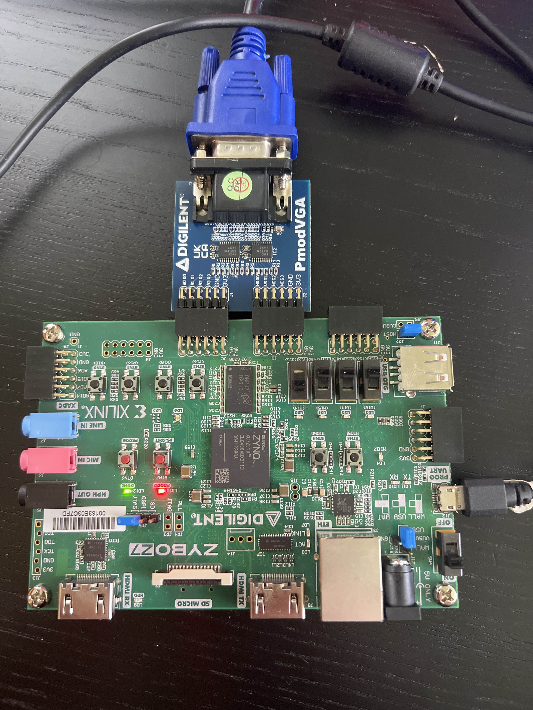
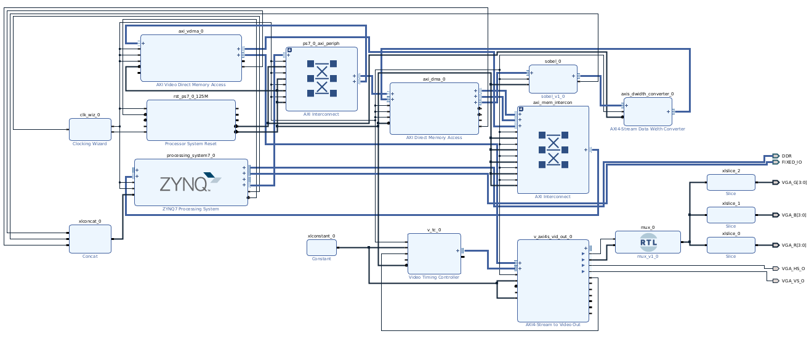
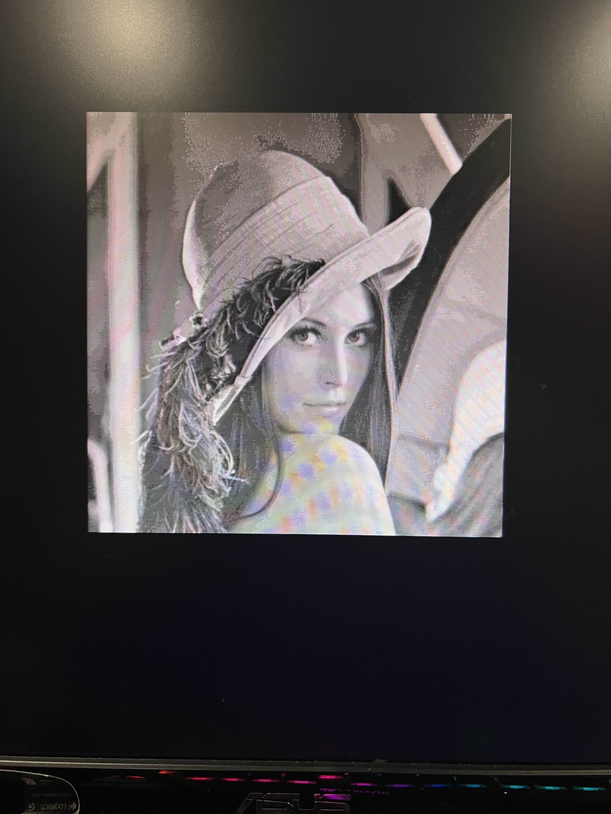
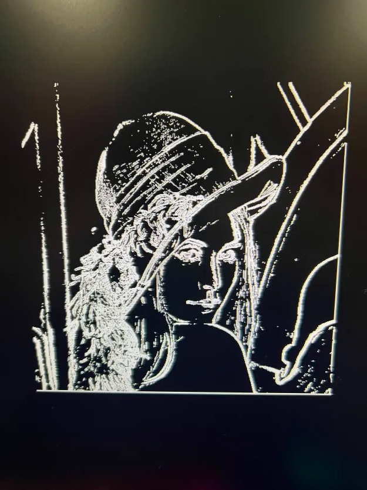

# Sobel Edge Detector on Zynq

## Overview
This project demonstrates the implementation of a real-time **Sobel edge detection system** using the **Zybo Z7-10 FPGA** board and the **Vivado IP Integrator**. The design offloads image processing to the programmable logic (PL) by integrating a custom Sobel filter IP core. The hardware design is created in Vivado, while the software interface is handled using **Vitis**, where the input image is loaded into memory as a character array and processed at runtime.

The system operates with a unified **148.5 MHz clock**, which is generated using a **Clocking Wizard** that converts the Zybo board’s native 125 MHz input to the required frequency for video timing and AXI peripherals. The video processing pipeline leverages **AXI Video Direct Memory Access (VDMA)** and **AXI DMA** to efficiently transfer image data between DDR memory and the Sobel filter core.

A **Video Timing Controller (VTC)** is used to generate synchronization signals compatible with the **VGA output**, which displays both the **original image** and the **Sobel-filtered image**. The output signals are separated into red, green, and blue components using slice IP blocks, and then sent to the Digilent VGA Pmod.

This project showcases how programmable hardware and software integration on a Zynq SoC can be used to build high-performance image processing systems suitable for real-time applications.

## Project Components
- Zybo Z7-10 FPGA Board
- Digilent VGA Pmod
- VGA-compatible Monitor
- USB programming cable
- HDMI-to-VGA adapter (if needed)
- Vivado 2022.1 or later
- Vitis 2022.1 or later

## Hardware Setup 

## Block Diagram

The block diagram below shows a hardware-accelerated image processing pipeline implemented on the Zybo Z7-10 using Vivado IP blocks. At the core of the design is a custom Sobel filter module connected via AXI DMA, allowing the system to process images streamed from memory. The output is displayed over VGA, with synchronization handled by the Video Timing Controller and pixel data routed through color slice blocks. The video data is 24 bits wide and is separated into three 8-bit color channels: red, green, and blue. Each channel is extracted using slice IP blocks before being sent to the corresponding VGA output pins.

## Results 

The three images below show the results of the Sobel edge detector when running the software side within Vitis.  The original image is loaded into the C program.  When the program is running, the user has two the options.  One option will display the original image and the other will display a filter version of that image.  The user interacts with the project using a serial terminal of choice.  In this case the Vitis serial terminal was used.  

[!Terminal Output](./screenshots/terminal_output.png)
## Future Work
- Record Video Demo
- C code fixes
- Update readme
